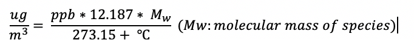
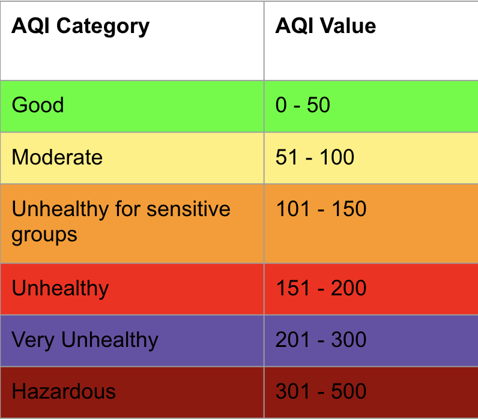
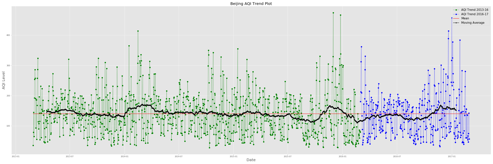

# Beijing Air Quality Time Series Analysis

## Background and Motivation

Air pollution in urban environments has risen steadily in the last several decades. As a growing and urgent public health concern, cities and environmental agencies have been exploring methods to forecast future air pollution, hoping to enact policies and provide incentives and services to benefit their citizenry. Much research is being conducted in environmental science to generate deterministic models of air pollutant behavior; however, this is both complex, as the underlying molecular interactions in the atmosphere need to be simulated, and often inaccurate. As a result, with greater computing power in the twenty-first century, using machine learning methods for forecasting air pollution has become more popular. This study investigates the use of the LSTM recurrent neural network (LSTM-RNN) as a framework for forecasting in the future, based on time series data of pollution and meteorological information in Beijing. Due to the sequence dependencies associated with large-scale and longer time series datasets, RNNs, and in particular LSTM models, are well-suited. To support the investigation of LSTM models for time series analysis, various supervised learning models like Random Forests/ExtraTreeRegressors are also implemented to test their predictive ability. 

The results show that the LSTM framework produces insufficient accuracy when predicting future timesteps compared to the baseline supervised learning regression models for a single timestep, which seem to perform well when handling different feature dimensions of input/output. However, by using LSTM frameworks when implemented in correct networks, we can extend the prediction from a various different time lags to various timsteps into the future. This is promising in the quest for forecasting urban air quality and leveraging that insight to enact beneficially for the public. 

## Dataset

The data for this investigation was procured from UCI's open Machine Learning Repository at: https://archive.ics.uci.edu/ml/datasets/Beijing+Multi-Site+Air-Quality+Data. 

Within the data directory, there is both meterological and pollutant information recorded on an hourly basis across 12 nationally-controlled air-quality monitoring sites from 03/01/2013 - 02/28/2017. Given the granular nature of air quality and weather data records, the dataset is appropriate for time series analysis predictions, where information relating to weather patterns or pollutant concentrations can be used to compute/predict air quality, which is converted into the AQI metric (Air Quality Index). 

In its raw form, the data contains information on:
- 6 atmospheric pollutants: CO, NO2, SO2, O3, PM2.5, and PM10 (recorded as ug/m3).
- 6 meterological factors: TEMP, PRES (pressure), DEWP (dewpoint), RAIN, WSPM (Wind Speed m/s), and Wind Direction (16 angular types). 

In preprocessing the data, attention must be given to converting pollutant concentrations to appropriate units with which they can be handled (O3 & CO: ppm, NO2 & SO2: ppb). The necessary conversions can be implemented using the following formula. 

                                                  
Additionally, feature engineering for the str-type wind direction is required to enable its predictive value in AQI. For this, we implement dummy columns that take all 16 wind directions into account. 

Finally, the time steps of data to be used in the analysis must be determined for the time-series prediction. Here, mean aggregation is performed on the meterological and pollutant data points across 24 hours for each day to condense the dataset into a daily format. Since AQI is predominantly determined by the concentrations of O3, PM2.5, and PM10 (which are influenced by alternative pollutants and weather), the following AQI formula is used to compute each pollutant's AQI value, the maximum of which is the deterministic AQI for that time point. 

For this investigation, the intial 3 years of data are used for training (2013-16), while data from the last year (2017) is used as a hold out set to examine how different time series predictor models perform. 

## Exploratory Data Analysis

AQI indices are categorized into various air safety brackets, representative of various degrees of pollution. 

Depicted below is the plot of the AQI fluctuation over the 4 year span covered by the Beijing dataset. The left part of the graph (green) represents the portion of the dataset that will be trained upon in following steps while the right hand side (blue) represents the trend for 2017, which is what the models will attempt to reproduce. 

Mean AQI: 138.6 (USG: Unhealthy for Sensitive Groups)

Global Maximum: 474.134663 (2015-12-01)

Global Minimum: 27.894771 (2014-10-12)	

On a surface level, a moving-average is plotted to identify/observe any prevalent trends in the AQI fluctuation in Beijing using rolling window splices of 30 days at a time. Although this plotted line does illustrate upward spikes in-and-around the winter seasons (Nov - Feb), there is no clear cut trend that can be discerned from the graph. This is corroborated by the inconclusive graphs of the trend-seasonal-residual decomposition that ARIMA packages provides. 

## Supervised Learning Time Series Analysis

The intial approach to the problem is to utilize common supervised learning models for forecasting future air quality levels in Beijing. There are 2 ways this can be approached using weather and pollutant data: 

- Multivariate Input to Multivariate Ouput: Train predictor variables to compute PM2.5, PM10, and O3 concentrations in order to formalize a predicted AQI level as these concentrations, and in turn AQI, are influenced by the training features
- Multivariate Input to Univariate Output: Train predictor variables to directly compute AQI levels at specific time points. 

The ExtraTreeRegressor package is used to train the mutlivarite to multivariate experiment, while GradientBoostingRegressor and RandomForestRegressor models were used to deal with the univariate output scenario. Each model was trained with and without feature selection, and hyperparameters were tuned for using GridSearchCV. The results are summarized below. 

Based on these results, the RandomForestRegressor model (without feature engineering/selection) is chosen for prediction due to the lowest test RMSE. Although this RMSE is representative of a shorter time scale, we deicde to use this to forecast the air quality for the entirety of 2017. GridSearchCV provides the following best fit hyperparameters: 
n_estimators = 100, max_depth = 140, max_features = 5, min_samples_leaf = 3. Below, we see that the forecasting ability of the model closely approximates the true trend for 2017. 

## LSTM Neural Network Time Series Prediction 

LSTMs take as inputs not only the current input, but also historic data points recorded, essentially using the output at time t − 1 as an input to current time t, along with the new input at time t. Given this, the network effectively has ’memory,’ unlike feedforward networks, given the memory allocated to errors stored in gated cells. This characteristic is important in discerning historical patterns in the sequences themselves, and not just the outputs. Because air pollution varies temporally, the best predictor of future air pollution is previous air pollution over long time periods.  A simple RNN is overlooked since it would have had poorer predictive accuracy and computational bottlenecks, since the data being trained on includes several historical samples collected through different timesteps. In this case, we use the univariate feature of AQI to predict future AQIs before we consider how historical weather and pollutant concentration sequences can be used as features to forecast AQIs. 

In this scenario, a simple LSTM was constructed and experimented with. The LSTM models implemented in this project utilize the 'adam' optimizer, 'mse' loss functions, 'tanh' activation, 128 neuron LSTM layer(s), and hidden layers of different sizes. In order to use 'tanh' in this scenario, values must be normalized to a 0, 1 range for appropriate implementation. In general, this activation function yielded lower errors than 'relu'. Fine tuning the LSTM model requires working around the time lag that the model is trained on, the prediction time period, and epoch & batch sizes for training. 

Below is a summary of the RMSE scores for some of the training configurations simulated. 

## Future Scope 

LSTM models are quite complicated in their training and require a proper analysis of their network architecture to accurately predict time series sequences. To expand on the results of this investigation, I would devote more time to do the following when building the LSTM Neural Network:

- train model on more historical points/use hourly data to predict hours ahead rather than days.
- find the optimal # of hidden layers and LSTM layers that can yield in high predicitve results. 
- determine the batch/epoch train limit that yields in best results. 
- determine the time lag that trains the LSTM the best. 
- implement the above while taking historical sequence data of weather and pollutant features (multivariate LSTM), which might lend itself to using a encoder - decoder architecture. 
